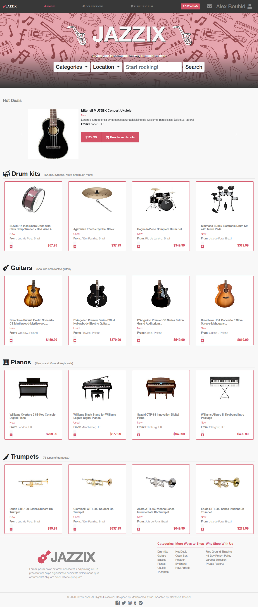
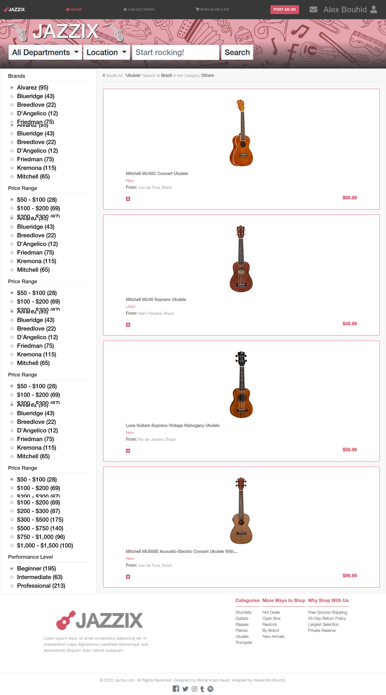

# Capstone-Project

> This project consists of creating almost from scratch an online shopping website based on Mohammed Awad's [ZATTIX](https://www.behance.net/gallery/24796463/ZATTIX) website. Fonts, colors and general positioning are required and content was chosen due to my love for music. There are 2 pages totally responsive for all types of viewports.

This project consists of building using:
- Bootstrap
- Media queries
- Align all elements with float and flex or grid.

## Built With

- HTML
- CSS

## DEMO

[Live Demo Link](https://raw.githack.com/abouhid/HTML-CSS-Capstone-Project/feature-branch/index.html)

### Prerequisites

- Browser (Google Chrome, Mozilla Firefox, Safari or any other browser)

### Setup

- Download or clone the repository's files
- Open the index.html file using any web browser of your choice

## Author

- Github: [@abouhid](https://github.com/abouhid)
- LinkedIn: [Alexandre Bouhid](https://www.linkedin.com/in/alexandrebouhid/)

## 🤝 Contributing

Contributions, issues and feature requests are welcome!

Feel free to check the [issues page](https://github.com/abouhid/Using-Bootstrap/issues).

## Show your support

Give a ⭐️ if you like this project!

## Acknowledgments

 - Thanks to Microverse for pŕoviding the opportunity to practice our coding knowledge

## 📝 License

This project is [MIT](lic.url) licensed.
Design idea by Mohammed Awad on Behance website.
